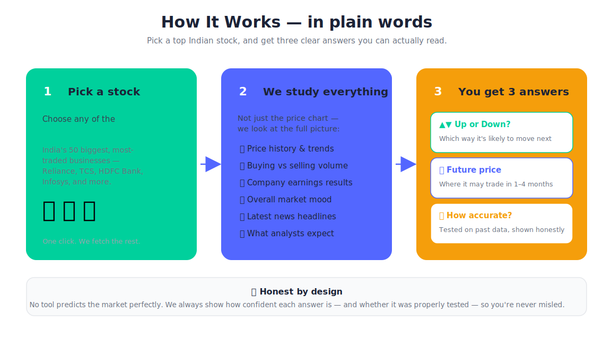
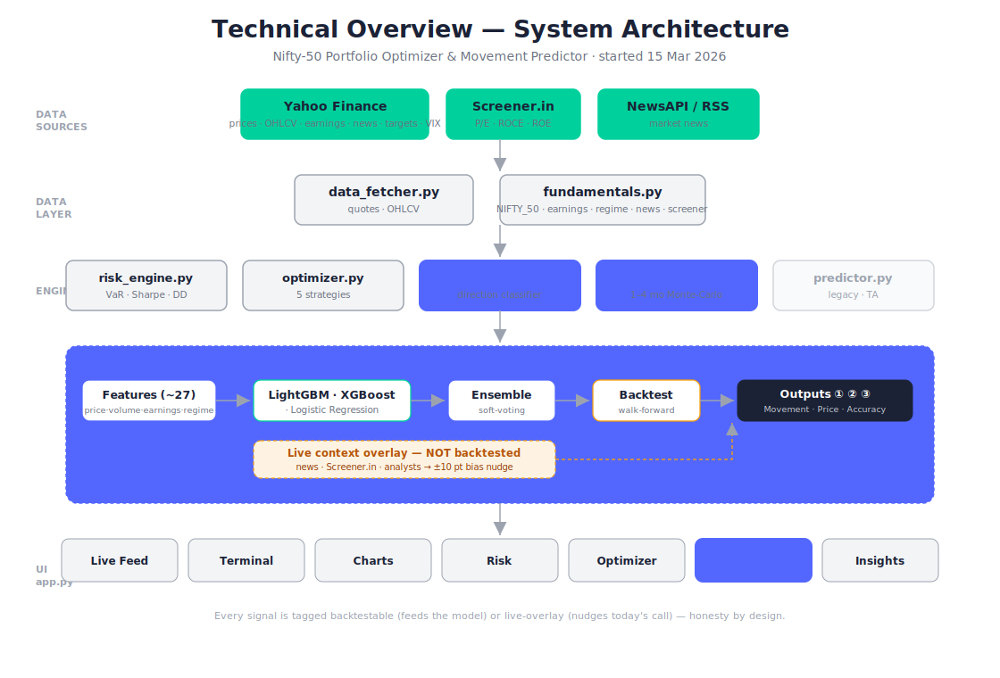
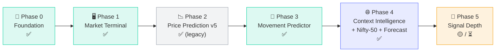
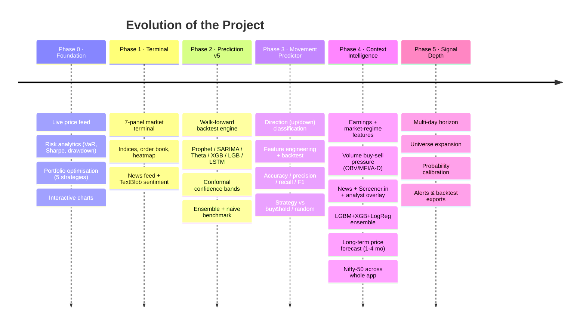
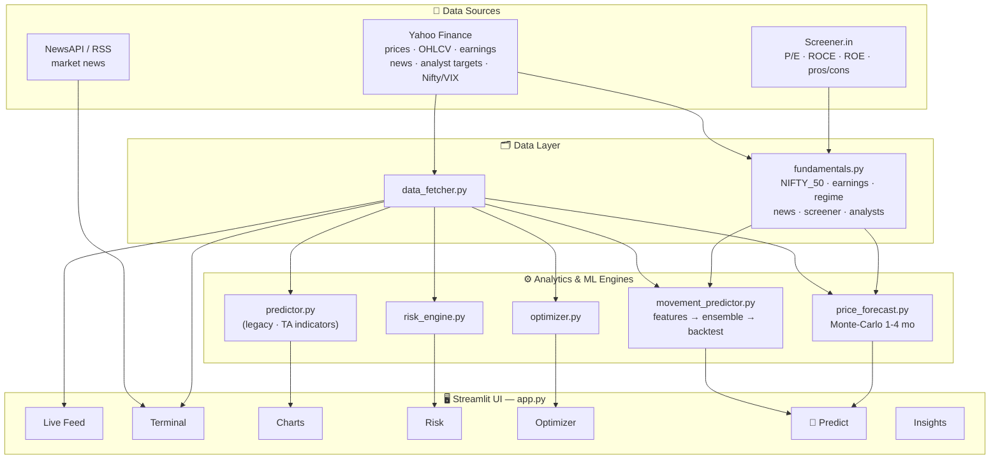
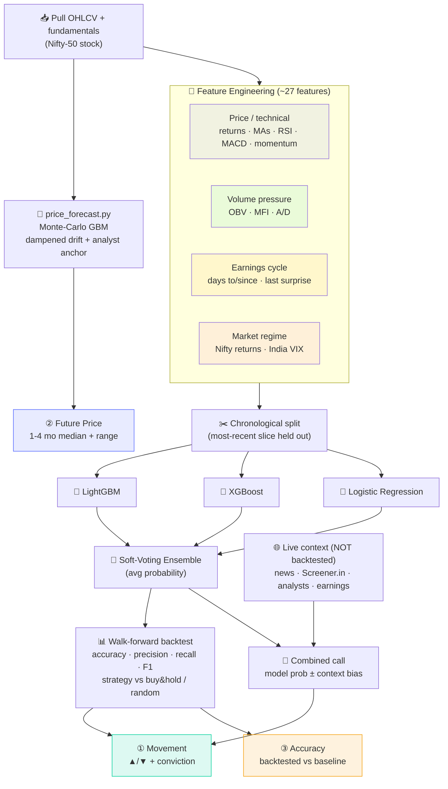
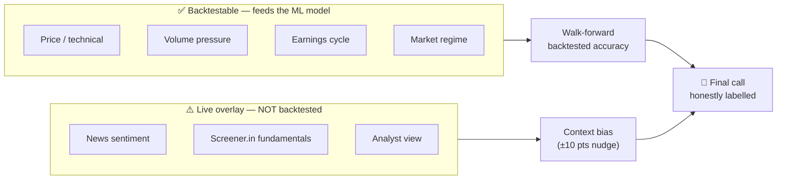

# 🗺️ Project Roadmap

How the **Nifty-50 Portfolio Optimizer & Movement Predictor** grew — from a portfolio-analytics dashboard into a fundamentals-aware stock movement predictor — and where it's headed next.

**Project started:** 15 March 2026 · **Current phase:** Phase 4 (July 2026)

> Legend: ✅ Done · 🟡 In progress · ⏳ Planned

### Two-minute overviews

**For everyone** — what the tool does, in plain words:

**For engineers** — how it's built:

---

## Phase Overview

---

## Timeline

---

## Phase Detail

### 🧱 Phase 0 — Foundation ✅
The portfolio-analytics core.
- `data_fetcher.py` · `risk_engine.py` · `optimizer.py`
- Live Feed, Charts, Risk, Optimizer tabs
- Groww-style UI, auto-refresh

### 🖥️ Phase 1 — Market Terminal ✅
- `terminal_tab.py` · `terminal_utils.py`
- 7 panels: indices, TA chart, order book, news, geo map, strategy signals, sector heatmap
- News + TextBlob sentiment (NewsAPI → RSS fallback)

### 📉 Phase 2 — Price Prediction v5 ✅ *(now legacy)*
- `predictor.py`: one walk-forward backtest shared by all models
- Prophet · Holt-Winters · SARIMA · Theta · XGBoost · LightGBM · LSTM · Monte Carlo + Ensemble
- Split-conformal confidence bands, skill-vs-naive scoring
- *Superseded in the Predict tab by Phase 3–4; still supplies Charts-tab indicators.*

### 🎯 Phase 3 — Stock Movement Predictor ✅
- `movement_predictor.py`: predict **next-day direction**, not exact price
- Feature engineering → classifier → **walk-forward backtest** → evaluation
- Metrics: accuracy, precision, recall, F1 + trading backtest vs buy&hold / random guess
- Honest framing: 1-day direction accuracy hovers near 50% and the UI says so

### 🌐 Phase 4 — Context Intelligence + Nifty-50 + Forecast ✅
The current release. Prediction stops being "just past prices."
- **Backtestable features** added: earnings-cycle, market regime (Nifty + India VIX), **volume buy-sell pressure** (OBV / MFI / A-D)
- **Model upgrade**: LightGBM + XGBoost + Logistic Regression → **soft-voting ensemble** (dropped RandomForest)
- **Live context overlay** (`fundamentals.py`): per-stock news, Screener.in fundamentals, analyst targets → a bias that nudges today's call
- **Long-term price forecast** (`price_forecast.py`): Monte-Carlo GBM, dampened drift, analyst anchor → 1/2/3/4-month median + 50%/90% bands
- **Nifty-50** is now the whole app's universe
- **Three headline outputs**: Movement · Future Price · Accuracy

### 🚀 Phase 5 — Signal Depth 🟡 / ⏳
- ⏳ **Multi-day horizon** (3/5-day direction) — the biggest lever to push accuracy above baseline
- ⏳ **Universe expansion** beyond Nifty 50 (Next 50 / midcaps)
- ⏳ **Probability calibration** (isotonic / Platt) for trustworthy confidence %
- ⏳ **Delivery volume & FII/DII flows** as features (where obtainable)
- ⏳ **Alerts & exports** — signal notifications, backtest CSV/report download
- ⏳ **Sector / peer momentum** features

---

## System Architecture

---

## Movement Predictor Pipeline

---

## Signal Honesty Model

A core design principle: every signal is tagged by whether it can be **validated**.

---

_Have an idea for a phase? The universe, features and models are all modular — see [README.md](README.md) for the module map._
